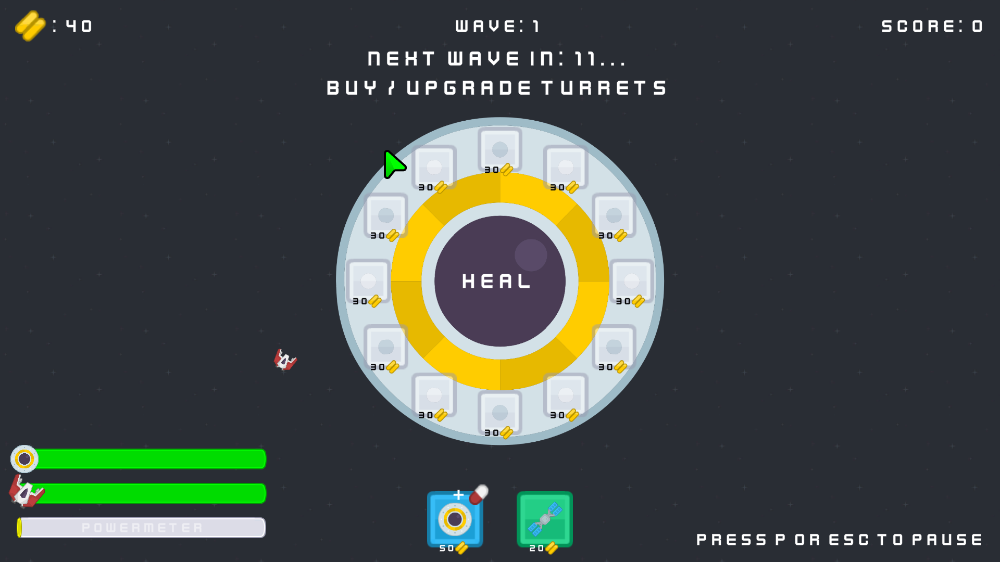
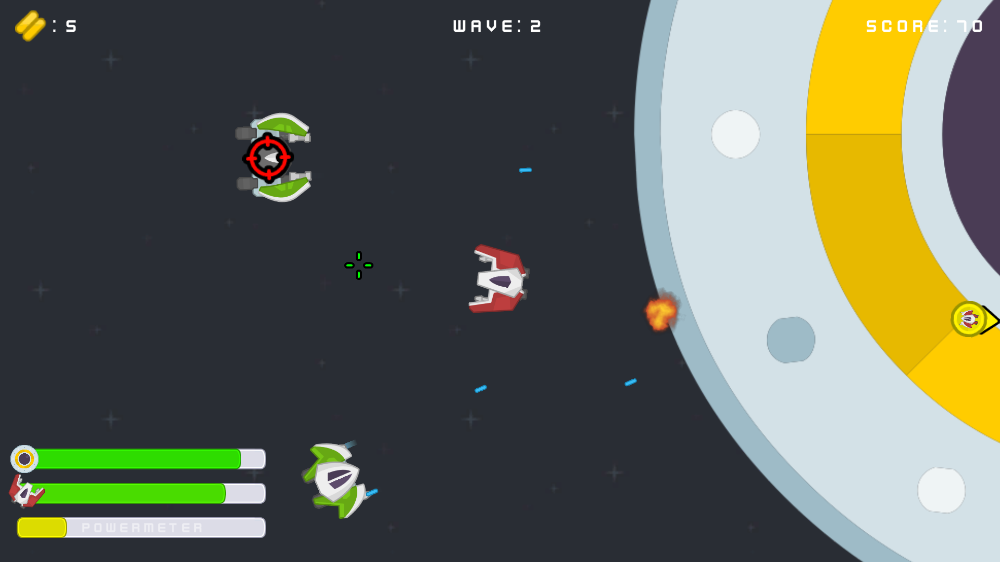
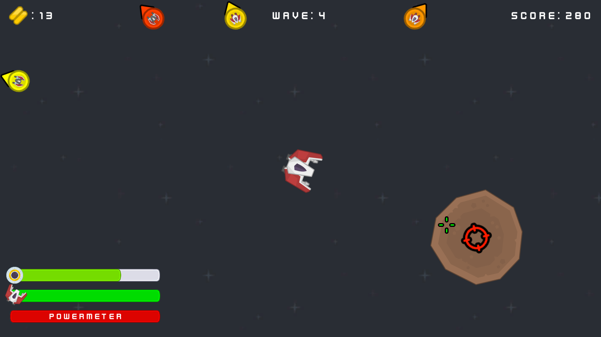
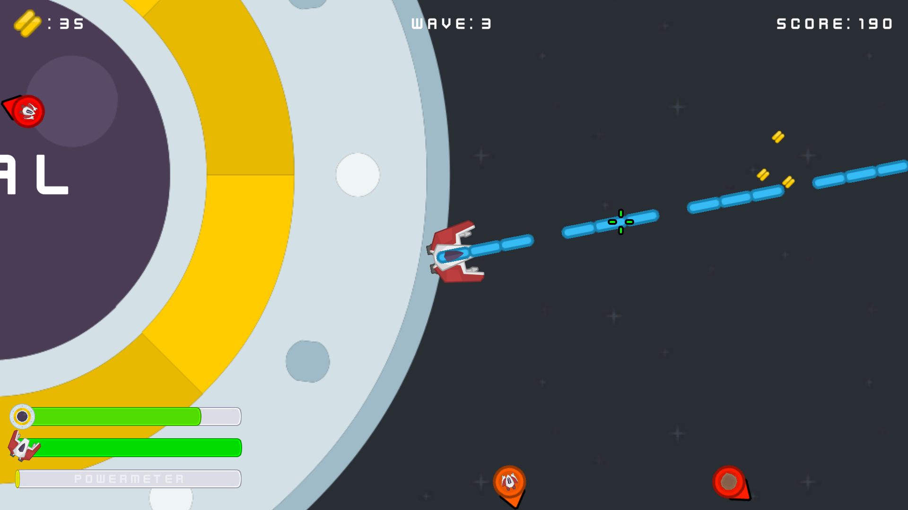
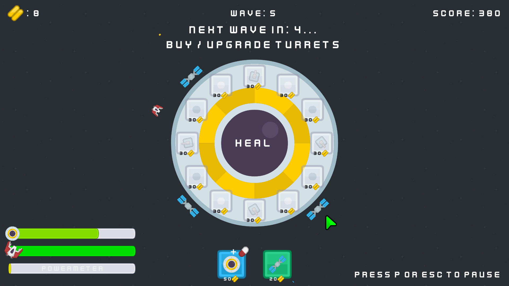

# Core Breach

**Core Breach** is a fast-paced 2D action tower defense game created for the [Kenney Game Jam 2025](https://itch.io/jam/kenney-jam-2025). You command a lone ship tasked with defending a vital power core from waves of increasingly aggressive enemies. Build turrets, deploy shields, and unleash devastating power blasts to hold the line.

This is my first ever game jam project—designed, developed, and submitted within the jam timeframe. The game explores the theme of **"power"** by combining strategic defense mechanics with dynamic offensive abilities.

---

## Development Info

Core Breach was developed using **Unity (2020.3)** and **C#**, with assets provided by [Kenney](https://kenney.nl/assets) as part of the jam's requirements. If you want to play this game you can do that in the browser on the following [link](https://h-gajdov.itch.io/core-breach). The project can also be opened and run in the Unity Editor by cloning this repository and opening it through Unity Hub.

---

## Features:
- Defend a stationary power core using your player-controlled ship
- Build and upgrade turrets directly on the core platform
- Deploy satellites to absorb incoming damage
- Manage power resources to heal
- Powermeter that fills as you kill more enemies in succession
- Unleash powerful overload blast when the powermeter is full
- Survive waves of unique enemies: fast scouts, armored tanks, and explosive meteors

---

## Future plans:
- Boss fight with multiple phases and mechanics
- Story mode with narrative and progression
- More turret types and weapon upgrades
- New enemy types with special abilities
- Pickups: healing, shields, damage buffs, and more
- Visual polish and UI/UX improvements
- Endless survival mode with scaling difficulty

---

## Screeshots

|  |  |  |  |  |
|:---------------:|:---------------:|:---------------:|:---------------:|:---------------:|

I hope you enjoy it!